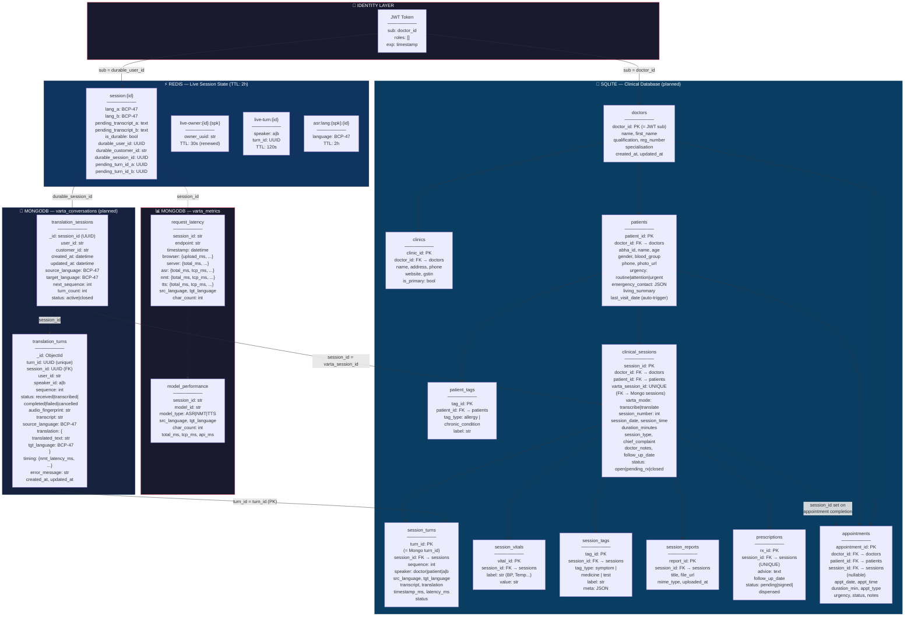
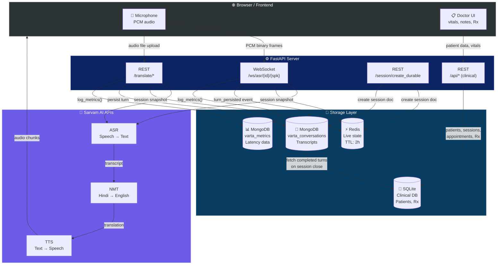
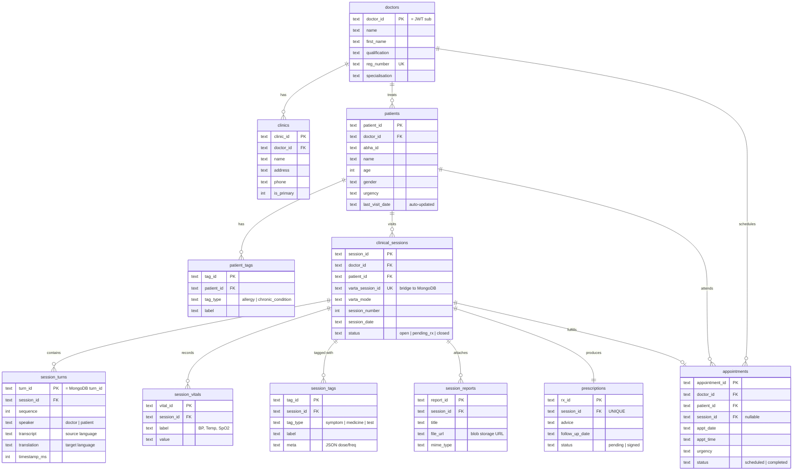
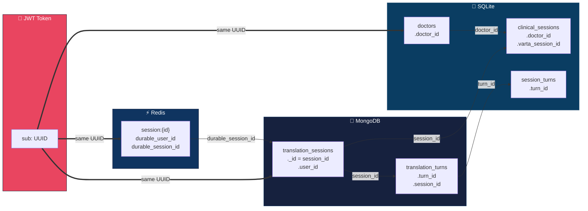

# Varta.ai — Hierarchical Database Structure

## 1. Full System Data Hierarchy

---

## 2. Data Flow — Write Path (How Data Moves Through The System)

---

## 3. Entity Relationship Diagram — SQLite Clinical Database

---

## 4. Cross-Database Bridge Points

> **One UUID rules them all:** The `sub` field from the JWT token is the same value used as `durable_user_id` in Redis, `user_id` in MongoDB, and `doctor_id` in SQLite. No ID translation layer needed — the three databases are joinable on this single key.

---

## 5. Reading Guide

| Diagram | What it shows |
|---|---|
| **§1 — Full Hierarchy** | Every table/collection/key across all 3 databases with all their fields, plus the FK arrows between them |
| **§2 — Write Path** | How audio from the microphone flows through Sarvam APIs and into all 3 storage systems |
| **§3 — ER Diagram** | Standard entity-relationship diagram for the SQLite clinical database (the one serving frontend getpoints) |
| **§4 — Bridge Points** | The 3 cross-database join keys that stitch Redis, MongoDB, and SQLite together using one UUID |
