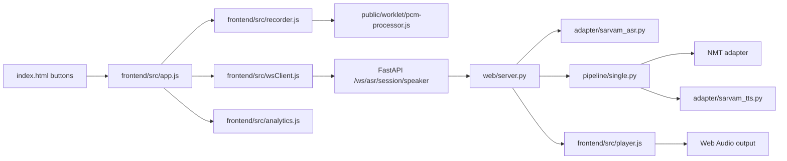

# Varta.ai Realtime Stack Stabilization

## Implementation plan - prompt level 1

**Repository:** `alfa-adi/varta.ai`  
**Branch reviewed:** `test-latency-tracking`  
**Scope:** Browser WebSocket lifecycle, live ASR/TTS coordination, PCM transport, session ownership, and observability  
**Status:** Planning only. This file does not modify application code.

## 1. Context from the current code

### 1.1 Current architecture as observed

The current application is a Vite-built vanilla JavaScript frontend served by FastAPI. The browser keeps a live connection per speaker, sends raw PCM microphone chunks, and receives transcript and synthesized audio messages. The server maintains process-local live adapter objects and streams to Sarvam. Render starts two Uvicorn workers under Gunicorn.

Relevant current paths and symbols:

| Area | Current code | Why it matters |
|---|---|---|
| Browser connection | `frontend/src/wsClient.js`, `LiveWS.open`, `LiveWS.close`, `LiveWS.stop` | The client guards only an already-open socket. It has no connecting guard, open timeout, generation token, or close handshake. |
| Browser orchestration | `frontend/src/app.js`, `ensureLiveWS`, `toggleRecord`, `handleLiveMessage` | The shared `wsClients` slot is assigned only after `open()` resolves. Concurrent clicks can therefore create more than one socket; an old socket can later clear the slot used by a newer socket. |
| Browser capture | `frontend/src/recorder.js` and `frontend/public/worklet/pcm-processor.js` | Audio is sent as transferred `Int16Array` chunks with an assumed 16 kHz rate. There is no explicit rate validation, bounded send queue, or in-flight start/stop guard. |
| Browser playback | `frontend/src/player.js` | Playback assumes 24 kHz linear PCM. `clear()` closes the context while already queued callbacks can still fire. The wire protocol does not currently carry the rate. |
| Server endpoint | `web/server.py`, `/ws/asr/{session_id}/{speaker}` | A shared process-local adapter and shared asyncio queue are used for a session-speaker. Every browser connection can create another broadcaster consuming the same queue. Disconnect cancels only the broadcaster and does not close the upstream adapter. |
| Upstream ASR | `adapter/sarvam_asr.py`, `SarvamLiveASRAdapter` | Reconnect can happen concurrently. `start_session()` can overwrite `_ws` while an older reader is still alive. `listen_transcripts()` is a single-consumer queue, not a broadcast. |
| Translation/TTS | `pipeline/single.py`, `adapter/sarvam_tts.py` | NMT and TTS execute inline in the server broadcaster loop. There is no turn ID. Comments/defaults still mention mp3/opus in places while the live path sends linear16 PCM. |
| Deployment | `render.yaml`, `Procfile` | Two workers plus process-local live state can split session creation and WebSocket requests. Redis, when configured, stores session metadata but cannot share live socket objects. |
| Measurement | `frontend/src/analytics.js`, `test/results/run_20260814_022948/report.html` | Browser metrics are partly estimated and the saved report cannot verify actual browser AudioContext playback. A Python endpoint test therefore cannot prove the frontend lifecycle. |

### 1.2 The observed reliability mismatch

The saved report `test/results/run_20260814_022948/report.html` reports 100 total turns, 95 clean turns, and 95.0% clean reliability. Its own limitations state that actual speaker playback requires a real browser AudioContext. The five failures are reported in the `od-IN` NMT/TTS section, which is useful provider evidence but not evidence that the browser opened, reused, stopped, or closed WebSockets correctly.

The local ignored script `test/scripts/run_baseline_test.py` is an endpoint-driven fallback test. It uses Playwright to call `window.injectAudio()` and captures REST translation endpoints. The current source and generated bundle do not expose `window.injectAudio`. This makes that script unsuitable as a release gate for the current WebSocket UI, even if it is useful as a separate pipeline smoke test.

Therefore the problem is not currently a reason to replace the stack. The primary risks are lifecycle ownership, concurrency, protocol ambiguity, process-local state, and an evaluation method that bypasses the frontend. A TypeScript or React migration may improve maintainability later, but it will not correct these runtime invariants by itself.

### 1.3 Sarvam API contract verified before implementation

The live adapter must follow Sarvam's current Realtime Streaming API, not the legacy streaming API. The authoritative references used for this plan are:

- [Sarvam Realtime Streaming guide](https://docs.sarvam.ai/api/api-guides-tutorials/speech-to-text/realtime-streaming)
- [Sarvam Realtime Streaming API reference](https://docs.sarvam.ai/api-reference/speech-to-text/transcribe/realtime/ws)
- [Sarvam Streaming TTS guide](https://docs.sarvam.ai/api/api-guides-tutorials/text-to-speech/streaming-api/web-socket)

The required ASR contract is:

| Contract item | Implementation requirement |
|---|---|
| Endpoint/model | Connect to `wss://api.sarvam.ai/speech-to-text-realtime/ws` with `model=saaras:v3-realtime` (or an explicitly tested `saaras:v4-realtime` migration). Do not use the legacy `/speech-to-text/ws` contract. |
| Authentication | Send `API-SUBSCRIPTION-KEY` from the server adapter. Never expose the key to the browser. |
| Required query | Always send `language_code` as a valid BCP-47 code or `auto`; never send `unknown` to this realtime endpoint. |
| Low-latency mode | Use `stream_type=fast` for the conversational path; keep `balanced` as a deliberate accuracy override, not an accidental default. |
| Turn mode | Use `endpointing=manual` and send one `speech_start` before the first audio frame and one `speech_end` after the last frame of every turn. Use `flush` only as a watchdog/forced-finalization action, not as a duplicate normal stop. |
| Audio | Send JSON `{"event":"audio_input","audio":"<base64>"}` containing mono signed linear16 PCM at exactly 16,000 Hz. The API accepts 8,000 Hz or 16,000 Hz only, and the declared rate must match the bytes. |
| Readiness | Wait for `session.begin` before sending audio and record its `request_id` and resolved configuration. |
| Results | Parse `transcript.partial`, `transcript.final`, and detected `language`/`language_confidence` when `language_code=auto`. |
| Errors/lifecycle | Parse structured `error` events (`code`, `is_fatal`, `message`) and `session.end` (`audio_duration_s`). Do not log-and-continue through fatal provider errors. |
| Keepalive/close | Send the realtime protocol `ping` and observe `pong` well before the documented idle timeout. Send `end` for graceful adapter shutdown. Classify close codes rather than blindly retrying every close. |
| Language normalization | Realtime ASR uses `or-IN` for Odia; the legacy streaming API uses `od-IN`. Normalize this at the adapter boundary so the rest of Varta and Bulbul continue using their documented `od-IN` code. |

The TTS contract must also be corrected to match Sarvam's current streaming guide. Bulbul v3 supports persistent WebSocket connections for multiple conversions. Configure the connection first with `language_code`, the selected `speaker`, `output_audio_codec="linear16"`, and `speech_sample_rate=24000`; call `convert`, then `flush`, consume `AudioOutput` chunks until the requested completion event, and keep the connection available for the next serialized conversion. Send a ping while an otherwise-idle connection is retained. The current adapter's use of `target_language_code` and its assumption that every Bulbul socket closes after one generation must be verified against the installed SDK and replaced with the documented `language_code`/persistent-connection behavior.

## 2. Implementation prompt

Implement the stabilization work described in this document against the current `test-latency-tracking` branch. Preserve the existing Vite/vanilla JavaScript frontend, FastAPI service, Sarvam ASR/NMT/TTS integration, and Render deployment shape unless an acceptance criterion cannot be met without a narrowly scoped change. Make the browser the source of truth for user-visible lifecycle state. Make each live WebSocket connection have one owner, one reader, one turn at a time, and one terminal event per turn. Add correlation IDs, deterministic cleanup, bounded queues, and measurements that distinguish browser lifecycle success from provider pipeline success. Follow the Sarvam contract in Section 1.3 exactly; do not copy message names or parameters from the legacy streaming API.

Before coding, reread the current files named in Section 1 and confirm that the implementation still matches the findings below. If a finding has changed, update the plan or record the discrepancy in the implementation PR rather than silently applying an obsolete fix. Do not replace the provider or frontend framework as a first response. Complete the changes in the order listed, run the unit/protocol checks, then hand the browser validation to the companion plan in `02-browser-streaming-validation-implementation-plan.md`.

## 3. Goals, non-goals, and invariants

### 3.1 Goals

1. Make `wsClients[speaker]` represent exactly one live connection owner per speaker and prevent duplicate in-flight opens.
2. Make a turn explicit and correlated from browser start through server terminal event and browser playback completion.
3. Ensure disconnects, reconnects, page unload, provider failures, and user stop actions release every task, socket, media track, and audio resource they own.
4. Prevent concurrent turns on one session-speaker and prevent stale events from changing current UI state.
5. Make PCM sample rates and formats explicit on the wire.
6. Keep upstream ASR reconnect serialized and make the server queue bounded.
7. Make two-worker Render deployment behavior explicit and testable.
8. Produce browser-observable metrics that can be compared with provider/pipeline metrics.

### 3.2 Non-goals

- Do not replace Vite, vanilla JavaScript, FastAPI, Render, or Sarvam as part of this stabilization plan.
- Do not treat the existing Python endpoint test as the browser acceptance test.
- Do not claim that a successful WebSocket handshake proves audio was captured, decoded, or audibly played.
- Do not share a Bulbul connection across unrelated users or sessions. Reuse one connection per owner/configuration when the installed SDK and provider contract support it, protected by a conversion lock.
- Do not share live Python WebSocket or adapter objects through Redis. Redis may carry session configuration and ownership metadata, but live objects remain owned by the worker that accepted the browser socket.

### 3.3 Required invariants after implementation

| Invariant | Required behavior |
|---|---|
| One browser connection | At most one active browser WebSocket per `session_id + speaker` in the frontend and server connection manager. |
| One upstream reader | At most one ASR reader task and one upstream socket for an adapter instance. |
| One turn | The browser cannot begin a new turn while the previous turn is in `CAPTURING`, `DRAINING`, `SYNTHESIZING`, or `PLAYING`. The server releases its pipeline lock after its terminal event; the browser releases its user-action lock only after playback finishes or a controlled error is shown. |
| One server terminal event | Every accepted turn ends with exactly one `audio_end`, `turn_error`, or `turn_cancelled`, carrying the same `turn_id`. `audio_end` means the server has sent all audio; it does not mean browser playback has finished. |
| No stale mutation | Events whose `turn_id` or connection generation is not current cannot reset the current button, player, spinner, or shared client slot. |
| Bounded memory | Browser send queues, server transcript queues, and outbound browser queues have fixed limits and observable overflow behavior. |
| Deterministic cleanup | Browser disconnect and page unload close the browser socket, cancel server tasks, close the upstream adapter and any owned TTS connection, and release the global connection lease. |
| Explicit audio format | Live messages identify PCM encoding and sample rate; the player does not rely on a hard-coded undocumented rate. |

## 4. Target design

### 4.1 Browser state machine

Implement a per-speaker state record instead of independent booleans. The record should include `speaker`, `socket`, `connectionGeneration`, `connectionState`, `turnState`, `turnId`, `openPromise`, `closePromise`, `recorder`, `player`, and timestamps. Valid connection states are `IDLE`, `CONNECTING`, `OPEN`, `CLOSING`, and `CLOSED`. Valid turn states are `IDLE`, `CAPTURING`, `DRAINING`, `SYNTHESIZING`, `PLAYING`, `COMPLETED`, `ERROR`, and `CANCELLED`.

`ensureLiveWS(speaker)` must return the existing `openPromise` while a socket is connecting, return the existing socket while it is open, and create a new generation only after the previous generation is closed. Every event handler captures its generation and exits without mutation if it is not current. `close()` must be idempotent and must not null a newer socket created after it.

### 4.2 Turn-correlated wire contract

Update the Varta live protocol as one coordinated frontend/server change. The Varta browser-to-server protocol may use binary frames for local transport, but the adapter-to-Sarvam protocol must use Sarvam's JSON/base64 `audio_input` messages. New Varta clients send a JSON `turn_start` before the first binary frame and a JSON `stop_recording` when capture ends. New server messages include the same `turn_id`. During one release cycle, the Varta server may accept a missing `turn_id` as legacy input, generate one, and emit a warning metric; the new frontend must never omit it.

| Direction | Message | Required fields |
|---|---|---|
| Browser -> server | `turn_start` | `type`, `turn_id`, `input_speaker`, `output_speaker`, `client_started_at` |
| Browser -> server | binary audio | PCM signed 16-bit little-endian, mono, 16,000 Hz, 20 ms chunks; associated with the active turn |
| Browser -> server | `stop_recording` | `type`, `turn_id`, `client_stopped_at` |
| Server -> browser | `server_ready` | `type`, `protocol_version`, `session_id`, `input_speaker`, `asr_model`, `encoding`, `sample_rate_hz` |
| Server -> browser | `transcript_partial` / `transcript_final` | `type`, `turn_id`, `text`, `language_code` when available, `language_confidence` on final when available |
| Server -> browser | `language_detected` | `type`, `turn_id`, `language_code` |
| Server -> browser | `audio_chunk` | `type`, `turn_id`, `format: pcm_s16le`, `sample_rate_hz: 24000`, `channels: 1`, `data` |
| Server -> browser | `audio_end` | `type`, `turn_id`, `reason`, `server_completed_at`; server audio stream is complete, browser playback may still be active |
| Server -> browser | `turn_error` | `type`, `turn_id`, stable `code`, user-safe `message`, `retryable` |
| Server -> browser | `turn_cancelled` | `type`, `turn_id`, `reason` |

The browser must ignore a message for an unknown or completed `turn_id`, while recording it as a stale-event metric. The server must reject a second `turn_start` while a turn is active with a stable `TURN_IN_PROGRESS` error and must not create a second pipeline task.

### 4.3 Server connection ownership

Add a server-side connection manager around the `/ws/asr/...` handler. The key is `session_id + speaker`. The manager owns the browser WebSocket, outbound send queue, adapter, broadcaster/producer tasks, active `turn_id`, and a connection generation. A second connection for the same key must either be rejected with a documented close code or replace the previous owner after the previous owner is fully closed; choose rejection for the first rollout because it makes duplicate frontend bugs visible. The close reason must be `DUPLICATE_CONNECTION`, not `TURN_IN_PROGRESS`, and the browser must not blindly reconnect on that reason. The manager must acquire a Redis lease so this invariant also holds when two requests land on different workers.

The handler must use one writer task for all browser sends. Transcript reading, NMT/TTS work, and browser writes must not share a queue consumer or call `send_*` concurrently. A bounded outbound queue must apply backpressure and terminate the turn with `OUTBOUND_BACKPRESSURE` if it remains full beyond the configured grace period.

On `WebSocketDisconnect`, cancellation, or handler error, the owner must:

1. Mark the connection generation closed.
2. Cancel and await the writer, transcript reader, and turn pipeline tasks.
3. Call `SarvamLiveASRAdapter.close()` exactly once.
4. Remove the manager entry only if it still points to the same generation.
5. Stop any browser-owned session TTL/lease and record cleanup duration.

If the native browser close event does not arrive within a bounded close timeout, force local cleanup and let the server observe the disconnect. Do not let `close()` await forever during network loss or page unload. Remove the adapter from `_live_asr_sessions` when its owner is released, or delete that registry in favor of the connection owner, so a later connection cannot reuse a closed adapter.

Do not keep the upstream Saaras socket alive after the browser owner is gone. If a future product requirement needs resumable sessions, implement that as an explicit lease protocol rather than accidental persistence.

### 4.4 ASR adapter lifecycle

Refactor `SarvamLiveASRAdapter` so `start_session`, `stream_chunk`, `signal_speech_end`, `ping`, `reconnect`, and `close` are serialized by one lifecycle lock. Build the Sarvam URL with `model=saaras:v3-realtime`, `language_code=<exact BCP-47 or auto>`, `stream_type=fast`, `endpointing=manual`, `encoding=linear16`, and `sample_rate=16000`. Do not use `unknown` for this endpoint. Wait for and validate `session.begin` before marking the adapter ready or accepting the first audio frame.

For each turn, send exactly one Sarvam `speech_start`, then JSON `audio_input` messages containing base64-encoded PCM, then one `speech_end` after the browser's final chunk has been accepted. Use `flush` only when the final-transcript watchdog requires forced finalization. On adapter shutdown send Sarvam `end` and await `session.end` when possible. Send an application-level Sarvam `ping` before the documented idle timeout and observe `pong`; the WebSocket library's control ping alone must not be assumed to satisfy the API-level keepalive contract.

A reconnect must first cancel and await the old reader, close the old socket, create the new socket, wait for its `session.begin`, then start exactly one reader. A reconnect request that arrives while another reconnect is active waits for the same promise/task. Retry transient network/internal closures with capped exponential backoff. Do not blindly retry invalid-parameter, authentication, quota, or fatal structured error responses.

Give each adapter instance a bounded transcript queue and expose counters for `upstream_connects`, `upstream_reconnects`, `reader_starts`, `reader_cancels`, `queue_depth`, `queue_overflows`, `session_begin_request_id`, `session_end_audio_duration_s`, `provider_error_code`, `provider_error_fatal`, and `upstream_close_reason`. `listen_transcripts` must be consumed by the owning server pipeline only. Do not add a second consumer as a shortcut for browser fan-out. Reset per-turn finalization state between utterances without discarding a later turn's frames.

### 4.5 Turn pipeline separation

Move NMT/TTS work out of the transcript broadcaster's receive loop. The pipeline should consume final transcript events for the active `turn_id`, invoke NMT, stream TTS chunks to the outbound writer queue, then publish exactly one server terminal event. Partial transcripts may update the UI but must not start duplicate NMT/TTS work. If multiple final events arrive for one turn, deduplicate by provider event ID where available, otherwise by a server-side finalization flag.

When audio exists, `audio_end` transitions the browser output player to `PLAYING`; only `player_audio_finished` transitions the browser turn to `COMPLETED` and unlocks the record control. When no audio is expected, `audio_end` may complete immediately after the browser confirms zero decoded samples. A `turn_error` or `turn_cancelled` is the exclusive terminal alternative and must not be followed by `audio_end`.

Timeouts must be explicit: browser open timeout, Sarvam `session.begin` timeout, upstream idle timeout, final transcript timeout, NMT timeout, TTS first-byte timeout, TTS completion timeout, and turn total timeout. Each timeout maps to a stable `turn_error` code and releases the server pipeline lock. A timeout while the browser socket is gone is recorded locally rather than sent to a closed socket.

### 4.6 Recorder and playback contract

The recorder must reject overlapping `start()` and `stop()` calls, and every start/stop promise must settle. The AudioWorklet must either resample to 16 kHz or report the actual input rate and let the recorder perform a deterministic resample before sending. Keep the 20 ms output chunk size after resampling. If the worklet cannot initialize or the microphone track ends, emit a recorder error that transitions the active turn to `ERROR`.

Do not implement the fallback as a naive integer decimator. Browsers may provide 44.1 kHz or 48 kHz even when a 16 kHz `AudioContext` hint is requested, and simple decimation aliases speech. Use a tested AudioWorklet resampler with fractional phase and an anti-aliasing low-pass step, producing exactly 16,000 mono samples per second. The test plan must exercise 16 kHz, 32 kHz, 44.1 kHz, and 48 kHz input contexts. If the worklet cannot guarantee the declared output rate, stop the turn with `AUDIO_SAMPLE_RATE_UNSUPPORTED` instead of sending mismatched bytes.

Use a bounded browser send queue. The queue must expose depth, maximum depth, dropped chunk count, and the time spent above the high-water mark. If the high-water condition persists for one second, stop capture and send `turn_error` with `AUDIO_BACKPRESSURE` rather than silently losing an unbounded amount of speech.

Update `AudioPlayer` to read `sample_rate_hz`, `channels`, and `format` from each audio message. Use a playback generation token so callbacks from a cleared player cannot fire completion events for the next turn. `clear()` must cancel scheduled sources, detach callbacks, and only then close/reset the context. The player must expose a test-observable `audio_started`, `audio_finished`, `audio_cleared`, and decoded-sample count.

### 4.7 Session and worker behavior

Treat Redis as required for the two-worker Render deployment. `/session/create` must write the target-language configuration and an expiry record to Redis. The WebSocket worker must load that configuration before accepting a turn. Never assume that the process handling `/session/create` is the process handling the WebSocket.

Acquire a Redis lease such as `live-owner:{session_id}:{input_speaker}` with `SET NX EX`, renew it while the browser socket is alive, and release it only when the lease token still matches. The worker-local manager remains responsible for live Python objects, but the Redis lease provides the cross-worker duplicate-owner invariant. A missing Redis connection is a deployment failure for two-worker mode, not a degraded mode that continues serving live sessions.

The live adapter and browser socket remain worker-local. The design must not require a later HTTP request to find or manipulate a live object. Add a startup connectivity check and a lease round-trip check. Add a test that deliberately routes two sessions across worker processes and a test that races two workers for the same `session_id + speaker` lease.

### 4.8 Observability

Replace estimated aggregate timings with event timestamps captured in the browser and server. Record at least:

- `connection_open_requested`, `connection_opened`, `connection_open_failed`, `connection_closed`;
- `turn_started`, `first_audio_frame_sent`, `last_audio_frame_sent`, `audio_end_received`, `turn_error`, `turn_cancelled`;
- `recorder_started`, `recorder_stopped`, `audio_chunk_sent`, `audio_chunk_dropped`;
- `player_audio_started`, `player_audio_finished`, `player_cleared`, `stale_event_ignored`.

Every event includes `session_id`, `input_speaker`, `output_speaker`, `connection_generation`, `turn_id` when applicable, and a monotonic timestamp. Keep provider timing fields separate from user-visible success. A speech turn is browser-clean only when the browser opened/used the expected socket, received a terminal event for the current turn, decoded non-zero audio when audio was expected, observed playback completion, and returned to an idle UI state. A no-speech or controlled provider-error turn has its own successful terminal classification and must not be marked as an audio-output success.

## 5. Detailed implementation work packages

Implement in this order. Each package must keep the application runnable before moving to the next.

### Package A - Browser connection manager

Files: `frontend/src/wsClient.js`, `frontend/src/app.js`, `frontend/index.html`.

- Replace the current `isOpen`-only guard with explicit connection state and a shared open promise.
- Add open, idle, close, and server-error timeouts.
- Add connection generation checks to `onopen`, `onmessage`, `onerror`, and `onclose`.
- Make `close`, `stop`, and repeated `destroy` calls idempotent.
- Store the socket in the per-speaker record before awaiting open, so a second click observes `CONNECTING`.
- Disable or ignore the record control while a turn is draining, synthesizing, or playing.
- Remove inline click behavior only if the replacement preserves keyboard accessibility and the current UI labels.

### Package B - Turn protocol and UI state

Files: `frontend/src/app.js`, `frontend/src/wsClient.js`, `web/server.py`.

- Generate a cryptographically random `turn_id` at turn start.
- Send `turn_start`, associate binary frames with that ID, and send `stop_recording` with that ID.
- Drive UI transitions from the state machine, not from a generic “message arrived” side effect.
- Ignore stale events and record them.
- Track `input_speaker` and `output_speaker` separately. Stop the input recorder, but flush/complete the output speaker's player; do not clear the wrong panel.
- On error or cancellation, stop the recorder, clear only the matching player generation, show a recoverable status, and release the turn lock.

### Package C - Server connection and pipeline ownership

Files: `web/server.py` and a focused module under `web/` if the handler becomes too large.

- Add the keyed connection manager and one browser writer.
- Add the bounded queues and cancellation/await cleanup.
- Add turn lock, turn ID validation, terminal-event deduplication, and timeouts.
- Separate partial transcript forwarding from final transcript pipeline work.
- Ensure NMT/TTS errors become correlated `turn_error` events rather than silently ending the broadcaster. Do not send `audio_end` after `turn_error`; the terminal outcomes are mutually exclusive.

### Package D - ASR lifecycle and cleanup

Files: `adapter/sarvam_asr.py`, related tests.

- Serialize lifecycle methods and keep the adapter's state machine separate from the browser's Varta turn state.
- Build the documented realtime URL and wait for `session.begin` before accepting the first `audio_input` frame.
- Send `speech_start`/`audio_input`/`speech_end` in the documented order for every utterance; use `flush` only for forced finalization; send `end` on graceful close.
- Parse and propagate `session.begin`, `transcript.partial`, `transcript.final`, structured `error`, `pong`, and `session.end` instead of logging provider errors and continuing.
- Ensure reconnect closes the old socket/reader before replacing `_ws`, retries only transient failures, and does not retry fatal/auth/quota/invalid-parameter failures.
- Use `auto` or a valid exact input language code, normalize realtime Odia `or-IN` to Varta/TTS `od-IN` at the adapter boundary, and never send `unknown` to the realtime endpoint.
- Expose safe close and counters, including Sarvam request ID, provider error code/fatality, and authoritative `session.end.audio_duration_s`.
- Bound the transcript queue and test overflow.

### Package E - Audio format correctness

Files: `frontend/src/recorder.js`, `frontend/public/worklet/pcm-processor.js`, `frontend/src/player.js`, `pipeline/single.py`, `adapter/sarvam_tts.py`, `web/server.py`.

- Make the input resampling/rate contract explicit.
- Produce exactly mono linear16 PCM at 16,000 Hz for Sarvam. Do not send raw browser-rate audio or rely on an integer-only decimator.
- Replace stale mp3/opus descriptions in the live path with `pcm_s16le` and explicit sample rate.
- Include playback metadata on audio messages.
- Add player generation protection and output events.
- Verify TTS output configuration and wire labels match the actual bytes.
- Change Bulbul streaming to one reusable connection per owner/configuration, serialized with a conversion lock. Configure first with the documented `language_code`, speaker, `output_audio_codec="linear16"`, and 24,000 Hz output; call `convert` then `flush`; consume through the completion event; keep the connection open for the next conversion; ping during idle periods.
- Do not close a Bulbul socket after every turn unless the provider returns a fatal/application close or the owner is being destroyed. Reconnect transient closes with backoff and surface 4xxx/auth/quota errors without blind retry.

### Package F - Session/deployment safety

Files: `render.yaml`, `Procfile`, `.gitignore`, `web/server.py`, session storage module/configuration, generated `web/static/*` artifacts, and frontend build/CI configuration.

- Document and enforce Redis requirements for two workers, including a cross-worker connection lease, not only session metadata storage.
- Add session metadata TTL and worker-independent configuration lookup.
- Do not attempt to serialize live WebSocket objects.
- Add startup diagnostics for missing/invalid deployment configuration and fail startup when two-worker live mode cannot reach Redis.
- Because Render currently serves `web/static` and its build command installs only Python dependencies, either build the frontend during deployment or require the implementation PR/CI to regenerate and verify `web/static/index.html`, the bundle, and `web/static/worklet/pcm-processor.js`. A comment in `render.yaml` or `Procfile` is not sufficient.
- Add a CI check that fails when `frontend/src`/`frontend/public` changes without matching generated static artifacts.
- Unignore the committed backend test files under `tests/`, or place them under a tracked test directory; the current `.gitignore` ignores `tests/` wholesale.

### Package G - Measurement and test hooks

Files: `frontend/src/analytics.js`, `frontend/src/app.js`, `frontend/src/player.js`, test-only support module.

- Emit lifecycle events with IDs and real monotonic timestamps.
- Add a test-only, read-only browser hook such as `window.__vartaTestHooks` exposing state snapshots and event subscriptions. The subscription must return an unsubscribe function, and the hook must be gated out of normal production builds. Do not expose a production audio injection method.
- Keep provider/pipeline counters separate from browser-clean counters.

## 6. Failure handling requirements

| Failure | Browser action | Server action | Required terminal result |
|---|---|---|---|
| Socket open timeout | Show reconnectable state; do not start recorder | Close generation and cancel tasks | `turn_error` only if a turn had started; otherwise connection failure metric |
| Duplicate click | Ignore or return the existing promise | No second `turn_start` accepted | One turn ID only |
| Browser closes during capture | Stop media tracks and release UI | Cancel turn, close adapter, remove owner | `turn_cancelled` in server logs; no stale browser mutation |
| Upstream ASR drop | Keep turn state while bounded reconnect runs | One serialized reconnect; no second reader | Continue if within timeout, otherwise `UPSTREAM_RECONNECT_FAILED` |
| Transcript queue overflow | Stop capture and surface degraded state | Cancel/close turn | `TRANSCRIPT_BACKPRESSURE` |
| NMT/TTS failure | Stop recorder, clear matching player, enable retry | Emit correlated error and release lock | `turn_error` with stable code |
| Late audio from old turn | Ignore in player/UI | Do not emit after terminal event | `stale_event_ignored` metric |
| Two-worker session mismatch | Show configuration error | Load session config from Redis or reject cleanly | No silent language fallback |

## 7. Rollout and compatibility

1. Land the Sarvam contract constants, provider event parser, Varta protocol schema, and contract tests first; do not begin with a browser-only client change.
2. Land server connection ownership, Redis lease acquisition, adapter/TTS cleanup, and terminal-event rules behind a feature flag if needed.
3. Land browser state/turn manager and recorder/player changes together with the new protocol.
4. Run the deterministic browser test environment and the API-contract cases in the companion validation plan.
5. Keep the first rollout at one worker unless the Redis lease and cross-worker tests are green; enable the final two-worker Render target only after those checks pass.
6. Compare old report-style pipeline metrics with the new browser-clean metrics for the same fixture set. Do not combine them into one percentage.
7. Remove legacy protocol support after one release cycle with zero legacy-client warnings for at least 24 hours, then delete the compatibility code and tests.

## 8. Acceptance criteria for implementation

The implementation is ready for browser validation only when all of the following are true:

- Static/unit tests cover connection generations, duplicate opens, idempotent close, stale events, turn lock, terminal-event deduplication, adapter reconnect serialization, and cleanup.
- A single browser session can complete at least ten turns per speaker without a new browser WebSocket per turn.
- A failed browser connection cannot leave an ASR adapter or reader task alive.
- Every new Varta live message carries the required correlation and audio-format metadata, and every Sarvam upstream message follows the documented event schema/order.
- Sarvam ASR sessions receive `session.begin` before audio, use exact 16 kHz/mono/linear16 input, use `auto` or a valid BCP-47 input code, and handle structured errors and `session.end`.
- Bulbul connections configure with documented language fields, stream linear16 at 24 kHz, use `flush`/completion events, and are reused only through a serialized owner/configuration connection.
- Two workers do not produce silent target-language fallback or split a single session-speaker across two live owners; Redis lease races are covered.
- Browser metrics report actual event timings and distinguish lifecycle, audio output, and provider pipeline outcomes.
- The deployment build or CI regenerates the `web/static` bundle/worklet from the modified frontend source and fails on stale artifacts.
- The companion browser test plan can run without `window.injectAudio()`, direct REST translation calls, or Python endpoint audio uploads.

## 9. Decision on stack replacement

Do not change the stack as part of this phase. The current stack is capable of meeting the required behavior once the ownership and protocol invariants are explicit. Revisit a TypeScript/React frontend only after the browser test gate is green and after measuring whether maintainability, not WebSocket correctness, is the remaining constraint. A framework migration before that point would add a second source of change while leaving the backend/session lifecycle risks intact.

## 10. Resolved decisions (formerly open questions)

### Q1 - Worker count during rollout

**Decision:** Keep two workers as the final Render target, but deploy the first stabilization rollout with one worker unless the Redis startup probe, global lease, heartbeat, release-token check, and two-worker race test are green. Two workers without a working cross-worker lease is not an acceptable degraded mode because it can create two owners for one session-speaker. Set the worker count through one explicit deployment setting; do not rely on an undefined `WORKER_COUNT` variable.

### Q2 - Legacy protocol grace period

**Decision:** The server accepts missing `turn_id` only for one release cycle. It generates a server-side ID, emits `legacy_turn_id_used`, and never allows the new frontend to omit the ID. Remove the compatibility branch after one release cycle and at least 24 hours with zero legacy warnings. The same rule applies to old message type/format aliases that are not part of the new protocol.

### Q3 - Recorder resampling

**Decision:** Resample in the AudioWorklet, before chunking and sending, because it keeps the 16 kHz contract close to the audio clock and avoids blocking the main UI thread. The implementation must use fractional-rate conversion with anti-alias filtering; a simple integer decimator is not sufficient for 44.1 kHz input. The worklet reports its actual input rate, produces mono linear16 16 kHz output, and fails closed with `AUDIO_SAMPLE_RATE_UNSUPPORTED` if it cannot guarantee the contract.

### Q4 - Duplicate connection close code

**Decision:** Use Varta's application-specific WebSocket close code `4409` with reason `DUPLICATE_CONNECTION` for a second owner attempt. Do not call it `TURN_IN_PROGRESS`; that is a different condition. The browser records the diagnostic and does not automatically retry this close. Use `1008` for an actual policy/authentication violation and reserve Sarvam provider close-code handling for the adapter's documented classification.
