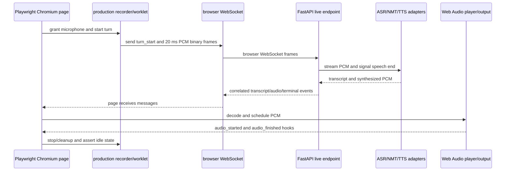

# Varta.ai Browser Streaming Validation

## Implementation plan - prompt level 2

**Repository:** `alfa-adi/varta.ai`  
**Branch reviewed:** `test-latency-tracking`  
**Scope:** Real browser capture, browser-owned WebSocket lifecycle, transcript/audio handling, UI recovery, and deployment validation  
**Status:** Planning only. This file does not modify application code.

> **Prerequisite:** This plan explicitly assumes that `01-realtime-stack-stabilization-implementation-plan.md` has been implemented, merged, deployed to the test environment, and passed its unit/protocol checks. Do not run this plan as the release gate against the pre-Plan-1 implementation. If Plan 1 is only partially implemented, record the gap and stop the affected test group rather than calling the result a browser reliability result.

## 0. Implementation prompt

Build and run a Playwright-driven Chromium test suite that exercises the actual Varta.ai browser path: page load, microphone permission, `getUserMedia`, the production recorder and AudioWorklet, browser WebSocket open/reuse/close behavior, server turn protocol, transcript handling, PCM decoding, Web Audio scheduling, UI state transitions, and cleanup. The test must use a browser-created `MediaStream` fixture or a real microphone device so the production browser capture path runs. It must not send audio chunks directly to an HTTP/WebSocket endpoint from Python, call REST translation endpoints, call `window.injectAudio()`, or treat a provider-only result as a frontend pass.

The suite must produce separate results for browser lifecycle, browser audio output, and provider/pipeline behavior. A provider failure may explain a failed turn, but it must not be counted as a frontend lifecycle failure unless the browser also violated its contract. A browser lifecycle pass requires evidence from the page and server that the same turn was opened, streamed, terminated, decoded, and returned to an idle/recoverable UI state.

## 1. What this plan is validating

### 1.1 Current testing gap

The saved report `test/results/run_20260814_022948/report.html` is valuable as a pipeline/latency snapshot, but it explicitly says that actual speaker playback cannot be verified by a Python runner because that requires a real browser AudioContext. It reports 95.0% clean reliability over 100 turns, with the recorded failures concentrated in an `od-IN` NMT/TTS section. That number cannot answer whether the frontend opens duplicate sockets, sends stop messages at the wrong time, drops audio while the socket is connecting, or plays a stale turn.

The local ignored file `test/scripts/run_baseline_test.py` is an endpoint-driven fallback test. It uses Playwright page evaluation to call `window.injectAudio()` and capture REST translation endpoints. The current frontend does not expose that method. It therefore must remain a separately labeled pipeline test and must not be used as the browser streaming release gate.

### 1.2 Required browser path

The release test must exercise this path in one real Chromium page:



The test may use a deterministic provider stub for the main gate, but it must still run the real browser and the real frontend/server WebSocket code. A separate staging smoke run may use Sarvam services and should preserve the same browser assertions.

### 1.3 Sarvam-aware assertions

The browser suite must validate the adapter's use of the current Sarvam Realtime Streaming contract, not merely that Varta's own WebSocket is open. The upstream assertions are based on the [Sarvam Realtime Streaming guide](https://docs.sarvam.ai/api/api-guides-tutorials/speech-to-text/realtime-streaming) and [API reference](https://docs.sarvam.ai/api-reference/speech-to-text/transcribe/realtime/ws):

- The upstream URL is `/speech-to-text-realtime/ws` with `model=saaras:v3-realtime` (or an explicitly tested v4 choice), `language_code=auto` or a valid exact input code, `stream_type=fast`, `endpointing=manual`, `encoding=linear16`, and `sample_rate=16000`.
- Authentication remains server-side through `API-SUBSCRIPTION-KEY`; the browser must never receive or log the Sarvam key.
- The adapter waits for `session.begin` before sending audio, then sends one `speech_start`, JSON/base64 `audio_input` frames, and one `speech_end` per utterance. It uses `flush` only for forced finalization and sends `end` when the owner is closed.
- The adapter parses partial/final transcript events, detected language and confidence when available, structured `error` events, `pong`, and `session.end.audio_duration_s`.
- The suite verifies no `unknown` language value is sent to this realtime endpoint and verifies the realtime Odia input code `or-IN`. Varta's internal/TTS normalization may use `od-IN` only after the ASR boundary.
- The adapter sends the documented application-level `ping` during idle periods and classifies provider close codes. It retries transient network/internal failures with backoff but does not blindly retry fatal, authentication, quota, or invalid-parameter failures.
- The TTS stub/staging observer verifies Bulbul is configured first with `language_code`, a supported speaker, `linear16`, and 24,000 Hz output; each conversion uses `convert` then `flush` and completes on the provider completion event. The connection is reused only through its serialized owner/configuration lock.

These checks must be visible in the per-turn report as `sarvam_contract_clean`; they must not be hidden inside `provider_pipeline_clean`.

## 2. Test environments and fixtures

### 2.1 Deterministic browser-gate environment

Run the application with the production browser bundle and FastAPI live endpoint, but inject deterministic ASR/NMT/TTS implementations through the existing adapter boundary or a test-only dependency configuration. The stub must simulate:

- partial transcript events followed by one final event;
- configurable final-transcript and first-audio delays;
- multiple audio chunks at 24 kHz linear PCM;
- an upstream disconnect and a recoverable reconnect;
- NMT/TTS failure and no-speech outcome;
- slow output sufficient to exercise UI draining and playback states.

Start the service with the same two-worker shape used by Render and start Redis for both session metadata and the cross-worker connection lease. Fail the test setup when Redis or the lease round-trip is unavailable. The main lifecycle gate must not accidentally run in a single-worker configuration while the production deployment uses two workers; a separate one-worker smoke run may be used only for early debugging.

The deterministic provider stub must assert the upstream message order and parameters above. It must also emit `session.begin`, partial/final transcripts, `error` with fatal/non-fatal variants, `pong`, and `session.end` so the adapter parser is exercised.

### 2.2 Browser audio fixture

Use two fixture modes:

1. **Browser-generated deterministic stream for CI:** decode a short WAV/PCM fixture inside Chromium with `AudioContext`, connect it to a `MediaStreamAudioDestinationNode`, and have the test-only `getUserMedia` provider return that real `MediaStream`. The production `recorder.js` and `pcm-processor.js` must receive the track and perform the normal worklet/chunk/send path. Do not bypass the recorder by sending bytes from the test.
2. **Physical microphone smoke:** run the same production page with a granted real microphone on a controlled staging machine. Verify actual audible output manually or through a browser audio capture sink. This is a smoke check and is not the deterministic CI gate.

The CI fixture set must include speech-like audio, a short silence, a long utterance that creates more than 50 chunks, and a fixture with a known end marker. Run the speech fixture with browser input contexts at 16 kHz, 32 kHz, 44.1 kHz, and 48 kHz. Record fixture sample rate and duration in the test report. The browser harness must confirm that the recorder resamples to exactly mono linear16 16 kHz before the server adapter sends Sarvam `audio_input`; it must not accept a mismatched declared rate.

### 2.3 Browser instrumentation contract

Plan 1 must provide a test-only, read-only hook such as `window.__vartaTestHooks`. The hook may expose snapshots and events, but it must not provide an audio injection method or an endpoint shortcut. At minimum expose:

- per-speaker connection state and connection generation;
- active `turn_id` and turn state;
- counts/timestamps for open, close, binary chunks sent, and stop messages;
- received message types and their `turn_id` values;
- recorder start/stop/error and queue high-water observations;
- player audio-started, decoded sample count, audio-finished, and clear events;
- stale-event-ignored and terminal-event-deduplicated counters.

The test may also use Playwright's WebSocket observation to count browser socket URLs. Server logs or a test-only metrics sink must provide adapter connect/close, reader start/stop, and connection-owner cleanup evidence. Do not use private Playwright internals as the only source of truth.

The provider observer must capture the exact Sarvam query parameters and ordered upstream event names without recording API keys or transcript content. The TTS observer must capture configuration, convert/flush/completion order, connection reuse count, and close reason.

## 3. Test execution rules

### 3.1 What is explicitly disallowed as the browser pass criterion

- A Python script that sends audio chunks directly to `/ws/asr/...`.
- A Python script that POSTs or captures `/translate/speaker_a` or `/translate/speaker_b` and calls that frontend validation.
- `window.injectAudio()` or any equivalent production bypass.
- A test that asserts only HTTP status, provider response, transcript text, or aggregate latency.
- A test that reports “audio succeeded” without a browser `AudioContext`/player event and decoded sample evidence.
- A test run against a single worker when the target deployment uses two workers.

The existing Python/REST test can still be run as a pipeline diagnostic. Label its output `pipeline_endpoint_smoke` and keep it out of the browser release score.

### 3.2 Required run configuration

Use a Chromium project with microphone permission granted for the app origin, a fixed viewport, a fixed timezone/locale, and a fresh browser context per test session. Serve the freshly built `web/static` output that production uses. Capture browser console errors, page errors, WebSocket lifecycle events, server lifecycle logs, provider-contract observations, and a trace/video for failures. Use a unique `session_id` per test and keep test sessions isolated.

Suggested scripts to add as part of the implementation:

```text
npm run test:e2e:browser-stream
npm run test:e2e:browser-stream:stress
npm run test:e2e:browser-stream:staging
npm run test:pipeline-endpoint-smoke
```

The first two commands are the release gate and stress suite. The staging command is a provider-backed smoke run. The last command is intentionally separate and must not change the browser score.

## 4. Browser test matrix

Every case must record: `session_id`, speaker, `connection_generation`, `turn_id`, expected result, observed result, browser events, server events, terminal event, audio output evidence, and cleanup evidence.

| ID | Condition | Browser action | Required assertions |
|---|---|---|---|
| B01 | Initial page and session bootstrap | Open the real page, grant mic, create a session, inspect both speaker controls | No page errors; session config is present; no socket opens before the first required action; controls are accessible. |
| B02 | First turn | Start speaker A, let the fixture stream, stop at the fixture end | `server_ready` precedes capture; exactly one `turn_start`; binary frames are sent by production recorder; one final transcript and one terminal event for the same `turn_id`; non-zero PCM is decoded and player emits `audio_started`; `audio_end` is followed by playback completion; UI returns to idle. |
| B03 | Rapid double click | Double-click the same record button within one event loop and repeat during `CONNECTING` | One connection generation and one `turn_id`; no duplicate recorder; second action is ignored or returns the same promise; no duplicate terminal event. |
| B04 | Stop while capturing | Start, wait for at least five chunks, click stop once | Recorder stops once; `stop_recording` carries the active ID; no chunks are sent after the stop boundary except documented flush frames; UI does not start another turn. |
| B05 | Click while draining/synthesizing/playing | Start a second click after stop but before `audio_end` or playback finish | Control is disabled or ignored; server sees no second `turn_start`; the first turn completes normally; no stale spinner reset; the output speaker's player, not the input speaker's player, is flushed/completed. |
| B06 | Ten turns on one speaker | Complete ten sequential turns on speaker A over one browser session | One browser WebSocket generation is reused; ten distinct IDs; ten terminal events; no duplicate readers/adapters; player generation changes per turn; Sarvam ASR connection is reused with one speech-start/audio-input/speech-end sequence per turn. |
| B07 | Alternating speakers | Complete A, B, A, B turns with distinct fixtures | Each turn uses the correct input/output speaker state, socket, transcript, player, and analytics labels; a terminal event for A never clears B; Odia uses `or-IN` upstream and the documented internal/TTS normalization. |
| B08 | Natural browser close | Start a turn, close the page, wait for server cleanup | Browser closes the socket; media tracks stop; server cancels/awaits tasks, calls adapter close once, removes ownership, and leaves no reader task. |
| B09 | Reload during playback | Reload after `audio_started` but before `audio_finished` | Old generation cannot mutate the new page; old player is cleared; the new page starts with no active turn or stale audio. |
| B10 | Browser socket drop while capturing | Test harness closes the browser WebSocket after several chunks | UI enters reconnectable/error state; no unbounded retry loop; the old generation cannot clear a replacement socket; the turn ends once with a clear code. |
| B11 | Upstream ASR drop | Provider stub drops Saaras connection once during capture | Exactly one reconnect sequence; no overlapping reader; old upstream socket closes before replacement; the turn either continues or ends with `UPSTREAM_RECONNECT_FAILED`; no retry is attempted for a fatal/invalid-parameter/quota error. |
| B12 | Delayed open | Delay browser/live endpoint open beyond the configured timeout | The page does not remain indefinitely in loading; open promise settles; recorder does not start on an unopened socket; retry is possible. |
| B13 | No speech/silence | Send silence fixture and stop | No false transcript/audio success; a correlated no-speech result or error is shown; the turn lock releases; next turn can start. |
| B14 | NMT/TTS failure | Make provider stub fail after final transcript | Browser receives correlated `turn_error`; player does not emit false audio success; UI returns to recoverable idle/error; next turn succeeds. |
| B15 | Late stale audio | Delay audio from turn 1 until turn 2 is active, or inject a server-side delayed message with turn 1 ID | Turn-1 audio is ignored and counted as stale; turn 2 player and UI remain unchanged. |
| B16 | Audio backpressure | Throttle server reads or outbound writes while streaming a long fixture | Browser queue remains bounded; high-water metric is emitted; overflow follows documented stop/error behavior; memory does not grow without limit. |
| B17 | Two workers | Run multiple isolated sessions and deliberately distribute HTTP and WebSocket requests across workers | Session target language is consistent; no live object is looked up in another worker; each session-speaker has one owner; Redis/session TTL behavior is visible. |
| B18 | Reconnect after idle | Complete a turn, close the socket, then start another turn | Reconnect creates one new generation; old generation cannot clear it; the new turn has a new ID and completes once. |
| B19 | Visibility/background | Move page to background or use a mobile viewport during capture and playback | UI remains recoverable; AudioContext resume policy is handled; no duplicate reconnect or silent permanent spinner. |
| B20 | Repeated sessions | Run 100 turns across at least ten fresh browser contexts | Zero leaked sockets/readers/adapters; browser-clean lifecycle is 100%; failures are classified by browser, server lifecycle, audio output, or provider pipeline. |
| B21 | Sarvam handshake contract | Inspect the provider observer during a normal browser turn | URL, auth path, model, `language_code`, `stream_type`, endpointing, encoding, and sample rate match Plan 1; `session.begin` is received before the first audio event. |
| B22 | Sarvam turn event ordering | Complete three turns with provider event tracing enabled | Each turn sends one `speech_start`, only JSON/base64 `audio_input` frames, one `speech_end`; `flush` is absent on normal stops and present only for forced-finalization tests. |
| B23 | Sarvam lifecycle/error events | Exercise idle keepalive, transient close, fatal error, and graceful close | `ping`/`pong` works before idle expiry; transient failures back off; fatal/auth/quota/invalid-parameter failures are surfaced without blind retry; `session.end.audio_duration_s` is recorded. |
| B24 | Sarvam audio-rate correctness | Run browser fixtures at 16, 32, 44.1, and 48 kHz input rates | Upstream always receives exactly mono linear16 16 kHz; no mismatched declaration, silent rate drift, or naive integer-decimation artifact. |
| B25 | Bulbul streaming contract | Complete five output turns with the same target language/voice | Config uses documented `language_code`, `linear16`, and 24 kHz; `convert` then `flush` precedes audio; completion event ends each conversion; reusable connection is serialized and not shared across sessions. |
| B26 | Generated production bundle | Build frontend and load the FastAPI-served static page | The served bundle contains the new protocol/lifecycle behavior and the served worklet matches source; the test fails if only `frontend/src` changed while `web/static` remains stale. |

## 5. Detailed assertions for a browser-clean turn

A turn counts as `browser_clean` only when all of these checks pass:

1. The page created or reused the expected connection generation without a duplicate open.
2. The recorder started after the socket was ready and sent binary frames through the production AudioWorklet path.
3. The `turn_start`, binary frames, and `stop_recording` were associated with one non-empty `turn_id`.
4. The page received transcript/audio messages carrying the same ID, or received a clearly correlated no-speech/error terminal event.
5. If the turn expected speech output, the output speaker's player decoded non-zero linear16 PCM using the declared 24 kHz metadata and emitted `audio_started`; `audio_end` was treated as server-stream completion and `audio_finished` was observed before the browser unlocked the next turn.
6. Exactly one terminal event was accepted by the browser; a provider `turn_error` was not followed by a false `audio_end` success.
7. The input speaker's recorder stopped exactly once and the output speaker's player returned to idle or a documented recoverable error state, with the control usable for the next turn.
8. Server cleanup counters show no leaked task, reader, adapter, TTS connection, or owner after the session closes.
9. The `sarvam_contract_clean` result is true: `session.begin` preceded audio, the upstream event order was valid, input rate was exactly 16 kHz, and structured provider errors/lifecycle events were handled.

Do not turn these checks into one opaque percentage. Report at least these independent dimensions:

| Dimension | Meaning |
|---|---|
| `browser_lifecycle_clean` | Connection, turn ID, terminal event, stale-event, UI, and cleanup invariants passed. |
| `browser_audio_output_clean` | Browser decoded expected audio and observed player/output events. |
| `server_lifecycle_clean` | Owner, reader, adapter, queue, cancellation, and worker behavior passed. |
| `sarvam_contract_clean` | Provider URL/parameters, event ordering, language/rate contract, keepalive, structured errors, and lifecycle events passed. |
| `provider_pipeline_clean` | ASR/NMT/TTS returned the expected provider result. |
| `overall_browser_turn_clean` | All required dimensions for that fixture passed; this is the release-gate rollup. |

## 6. Test sequence

### Stage 1 - Contract smoke

Run B01-B05 and B21-B26 against the deterministic environment. Stop immediately on a duplicate socket, missing `server_ready`, missing `session.begin`, invalid upstream parameters, invalid audio rate, missing turn ID, missing terminal event, or player decode error. These are contract failures and make later stress percentages misleading.

### Stage 2 - Lifecycle and failure matrix

Run B06-B19 with one browser context per logical session and collect traces for every failure. For each failure, classify the first violated invariant, not the last visible symptom. For example, a spinner left on screen after a provider error is a browser/UI failure even if the provider error is expected.

### Stage 3 - Stress and leak run

Run B20: 100 turns, at least 50 on each speaker, at least ten browser contexts, two service workers, and a mix of normal, silence, delayed, reconnect, and provider-failure fixtures. Repeat the run at least three times before declaring the lifecycle gate stable. Check process task/socket counts before and after every context batch and verify the Redis lease is released by its owner token.

### Stage 4 - Real-provider staging smoke

Run ten turns across the supported high-value languages with the real Sarvam integrations. Include at least one `auto`-detect turn, one exact-language turn, and one Odia turn that sends `or-IN` to realtime ASR while using `od-IN` for Bulbul/TTS where required. Keep this result separate from the deterministic browser gate. Capture provider request ID, status, latency, close code/reason, and error code; do not lower the browser lifecycle score because a provider quota, language, or upstream availability issue failed.

### Stage 5 - Legacy diagnostic comparison

Optionally run `test/scripts/run_baseline_test.py` or its replacement. Label the result `pipeline_endpoint_smoke`, compare it only to historical pipeline reports, and explicitly state that it bypasses browser WebSocket/audio lifecycle. It is useful for detecting provider regressions, not for approving the frontend.

## 7. Pass/fail thresholds

### Release gate

- Deterministic browser suite: 100% `browser_lifecycle_clean` across the 100-turn run and all three repeated runs.
- Deterministic browser suite: 100% `server_lifecycle_clean`; zero leaked owners, readers, adapters, or unhandled page errors.
- Deterministic browser suite: 100% `sarvam_contract_clean`; zero invalid upstream parameters, invalid rates, wrong language-code aliases, or unhandled structured provider errors.
- Every accepted turn has exactly one terminal event and no unclassified stale-event mutation.
- Every expected audio turn has browser decode evidence and a player/audio-started event.
- No duplicate browser socket generation for a normal sequence of ten turns per speaker.
- Two-worker run passes session configuration and ownership assertions.

### Non-gating diagnostics

- Real-provider staging results may be below 100% because provider availability and language coverage are external variables, but every failure must be classified and visible.
- Historical Python/REST results remain comparable only as provider/pipeline evidence.

Any release-gate failure requires a linked trace, browser event log, server lifecycle log, and classification. Do not rerun until the first violated invariant has a proposed fix or an explicitly accepted test-environment defect.

## 8. Deliverables from the test implementation

Produce:

- Playwright browser-streaming tests and fixtures;
- Provider-contract observers/stubs that assert Sarvam ASR and Bulbul message ordering, parameters, keepalive, completion, and error handling;
- deterministic provider stubs or test adapter configuration;
- test-only browser observability hooks with production-safe guards;
- machine-readable JSON results with the dimensions in Section 5;
- a human-readable HTML report that shows per-turn socket, turn, audio, UI, server cleanup, and provider evidence;
- failure traces/screenshots/videos for non-passing cases;
- a short runbook explaining local, two-worker, and staging-provider execution;
- a clear note in the old pipeline test report that it is not the browser release gate.

## 9. Final decision rule

Do not decide to replace the frontend or backend stack based on the current 95% Python/endpoint result. First make the Plan-1 lifecycle contract true and make this browser test gate trustworthy. If the stabilized implementation passes the deterministic browser gate but the code remains difficult to evolve, then evaluate a TypeScript/React migration as a separate maintainability project. If it fails the browser gate, fix the ownership/protocol/lifecycle defect that the trace identifies before considering a stack change.
