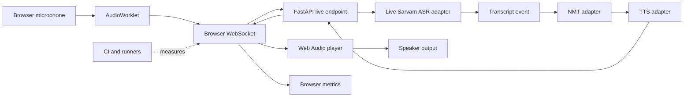

# Varta.ai System Quality and Traceability Flaw Register

## Review basis

**Repository:** `alfa-adi/varta.ai`  
**Branch reviewed:** `test-latency-tracking`  
**Remote revision reviewed:** `ed99af01659097d61eb6b5d2c09f9be03c84a3b9`  
**Review type:** Documentation-only architecture and reliability review  
**Status:** Findings and controls proposed; this file does not modify application behavior.

This register traces the system against five properties that determine whether a realtime product can be trusted and evolved safely:

1. **Immutability:** state and events have one owner, are not silently overwritten, and cannot be changed by an unrelated turn or connection.
2. **Adaptability:** provider, audio, deployment, and browser variations are explicit configuration or supported contracts rather than hidden assumptions.
3. **Reproducibility:** another engineer or CI runner can recreate the same test conditions and obtain comparable results.
4. **Component isolation:** each component can be exercised behind a narrow contract without requiring a live provider, a real browser, or unrelated mutable global state.
5. **Change traceability:** every behavior change can be connected to a requirement, code location, test, runtime metric, and deployment revision.

The severity scores below use a 1–5 risk scale. **5** means that the flaw can invalidate a result, corrupt a live turn, or cause a production failure. **1** means limited local impact.

## Executive assessment

| Quality property | Current score | Assessment |
|---|---:|---|
| Immutability and ownership | 1/5 | Live state is mutable, process-local, and can be shared by competing handlers. |
| Adaptability | 2/5 | Several values are hard-coded and the provider/browser contract is duplicated in comments, adapters, and runners. |
| Reproducibility | 1/5 | The branch has provider probes and REST smoke scripts, but no browser streaming release test and no committed browser fixture set. |
| Component isolation | 2/5 | Some pure pipeline boundaries exist, but live adapters, queues, and WebSocket handlers are coupled through process state. |
| Change traceability | 1/5 | Turn identity, connection generation, test evidence, and deployed revision are not consistently linked. |

The stack is not inherently unfit. The dominant problem is missing ownership and evidence discipline around the realtime path. Replacing Vite, vanilla JavaScript, FastAPI, or Sarvam would not repair these invariants by itself.

## System path under review



The key traceability break is that the existing runners do not follow the solid browser path. `probe_asr_ws.py` calls Sarvam directly, while `smoke_test_render.py` calls REST endpoints. Neither proves that the browser path worked.

## Evidence and linkage map

| System concern | Branch location | Expected owner | Current condition | Traceability gap |
|---|---|---|---|---|
| Browser state | `frontend/src/app.js` | One state record per speaker and turn | Recorders, players, and sockets are coordinated by mutable module-level objects. | No durable connection generation or turn identity in the reviewed remote branch. |
| Browser connection | `frontend/src/wsClient.js` | One `LiveWS` instance per `session_id + speaker` | The client tracks `isOpen`, but the application assigns the shared slot only after open completes. | Rapid actions can create competing opens; close events have no generation check. |
| Microphone capture | `frontend/src/recorder.js` | One recorder owner per speaker | Worklet and stream lifetimes are managed inside a mutable recorder object. | No standalone browser contract test proves start, stop, error, and cleanup behavior. |
| Audio transport | `frontend/public/worklet/pcm-processor.js` | Explicit PCM format and sample rate | The worklet emits PCM based on an assumed 16 kHz contract. | Runtime rate negotiation and mismatch evidence are incomplete. |
| Server WebSocket | `web/server.py` | One browser handler and one upstream owner | Live adapters are retained in `_live_asr_sessions`, keyed by session and speaker. | Competing handlers can reach the same adapter and queue. |
| Upstream ASR | `adapter/sarvam_asr.py` | One socket, reader, queue, and reconnect loop per adapter | A live adapter contains mutable socket, queue, and reader state. | Ownership is not a shared cross-worker invariant. |
| Translation/TTS | `pipeline/single.py`, `adapter/sarvam_nmt.py`, `adapter/sarvam_tts.py` | One ordered pipeline per turn | Provider calls are covered by endpoint/provider tests more than by browser-turn tests. | First-audio timing cannot be attributed to a browser turn with confidence. |
| Session metadata | `web/server.py` | Immutable event history plus explicit current snapshot | Session data is stored in mutable dictionaries, in memory or Redis. | A current snapshot does not prove which turn produced it. |
| Measurement | `frontend/src/analytics.js` | Browser timestamps correlated to server timestamps | Existing measurement is split between provider, REST, and browser-oriented paths. | Results cannot be compared on the same lifecycle. |
| Runner and CI | `probe_asr_ws.py`, `smoke_test_render.py`, `.github/workflows/ci.yml` when present locally | Reproducible browser and component gates | Remote branch lacks a complete browser gate and the local workflow is not the same as the remote branch. | A passing local result can be from code that is not committed or deployed. |

## Major flaw register

### IMM — Immutability, ownership, and state integrity

| ID | Finding and evidence | Risk | Consequence | Required control |
|---|---|---:|---|---|
| IMM-01 | `_live_asr_sessions` is a mutable process-local registry in `web/server.py`. | 5/5 | A reconnect or second handler can overwrite or reuse live state without an auditable ownership decision. | Give every adapter a single owner, an explicit lease, and an owner token. Release only when the token matches. |
| IMM-02 | The ASR adapter contains mutable `_ws`, `_reader_task`, readiness, queue, and language state. | 5/5 | Concurrent start/reconnect can replace a socket while an older reader remains alive. | Serialize start, reconnect, send, and close operations. Make reader ownership one-to-one. |
| IMM-03 | Session snapshots are mutable dictionaries saved by key. | 4/5 | A later turn can overwrite language or pending data before the earlier turn is traced. | Treat session events as append-only records with a derived current snapshot. Include `session_id`, `turn_id`, speaker, event type, and server timestamp. |
| IMM-04 | Browser `wsClients`, recorder state, player generation, and timers are independent mutable objects. | 5/5 | A late close, `audio_end`, or error can mutate a newer turn. | Use a single per-speaker state machine and reject events whose connection generation or `turn_id` is stale. |
| IMM-05 | The output player schedules mutable Web Audio state while `clear()` can close the context and invalidate queued work. | 4/5 | Old audio callbacks can fire after a new turn has started or after output was cleared. | Associate every scheduled source with a generation token and record ignored callbacks. |

### ADP — Adaptability and contract boundaries

| ID | Finding and evidence | Risk | Consequence | Required control |
|---|---|---:|---|---|
| ADP-01 | Audio rate and encoding assumptions are duplicated across recorder, worklet, ASR adapter, player, and comments. | 5/5 | A browser running at 44.1 or 48 kHz can produce a declaration/byte mismatch or an avoidable conversion path. | Define one typed audio contract: source rate, transport rate, encoding, channels, chunk duration, and output rate. Emit it in test evidence. |
| ADP-02 | The player defaults to 24 kHz PCM when metadata is absent. | 4/5 | A provider or server format change can produce speed/pitch errors while appearing to be a successful turn. | Require format metadata on every audio generation; reject missing metadata in the test gate. |
| ADP-03 | Provider protocol details are embedded in adapter code and standalone probes. | 4/5 | A provider endpoint, event name, language code, or close behavior can change in one place but not another. | Keep a versioned provider contract module and contract-test it with a deterministic provider stub. |
| ADP-04 | The live route and REST route are treated as interchangeable by the smoke tooling even though their lifecycle contracts differ. | 5/5 | REST success can be reported as realtime success. | Give live WebSocket and REST pipeline tests separate names, metrics, and acceptance criteria. |
| ADP-05 | Deployment worker count and live-state assumptions are coupled. `Procfile` specifies two workers while `render.yaml` specifies one. | 4/5 | A deployment change can silently invalidate process-local ownership and produce intermittent cross-worker behavior. | Put worker count and required Redis/lease configuration in one deployment contract and test the deployed shape. |
| ADP-06 | `npm install` is used in the Render build command rather than a lockfile-enforcing install. | 3/5 | A future dependency publication can change the generated browser bundle without a source change. | Use `npm ci`, record Node/npm versions, and archive the bundle hash. |

### REP — Reproducibility of tests and runtime results

| ID | Finding and evidence | Risk | Consequence | Required control |
|---|---|---:|---|---|
| REP-01 | `probe_asr_ws.py` calls `wss://api.sarvam.ai/...` directly. | 5/5 | It measures provider connectivity, not Varta browser reliability. | Label it provider-only and exclude it from frontend reliability. Add a browser test through `/ws/asr/...`. |
| REP-02 | `smoke_test_render.py` calls `/translate/speaker_a` and `/translate/speaker_b`, while the browser uses `/ws/asr/{session_id}/{speaker}`. | 5/5 | The reported pass/fail result bypasses the failing lifecycle. | Replace the release gate with a Playwright Chromium test using the production recorder and worklet. |
| REP-03 | The remote branch tree does not contain a complete committed browser test workflow, while a workflow exists in the local uncommitted tree. | 5/5 | Local evidence may not run on GitHub or deployment. | Commit the workflow, make it run on the target branch, and publish its artifact and revision. |
| REP-04 | The probe sends the full recording as quickly as possible and then flushes it. | 4/5 | It does not reproduce microphone cadence, jitter, backpressure, or user stop timing. | Pace fixture frames in real time and add controlled jitter, delay, reconnect, and stop/start scenarios. |
| REP-05 | The probe and smoke runner refer to `test/datasets/...`, but the reviewed remote tree does not include the referenced `test` fixture directory. | 5/5 | A fresh checkout cannot run the advertised scripts successfully. | Commit small licensed fixtures or generate deterministic fixtures during setup; fail clearly when a fixture is unavailable. |
| REP-06 | `npm install` and unbounded provider behavior make the environment non-deterministic. | 3/5 | A rerun can use different frontend dependencies or provider timing. | Pin toolchain versions, use lockfile installs, stub provider behavior for CI, and reserve live provider tests for staging. |
| REP-07 | The existing reliability percentage combines provider/pipeline outcomes with assumptions about browser playback. | 5/5 | A 95% or 100% number can be interpreted as frontend reliability when it is not. | Publish separate `browser_lifecycle_clean`, `browser_audio_clean`, `provider_pipeline_clean`, and `overall_clean` metrics. |

### ISO — Independent functioning and component isolation

| ID | Finding and evidence | Risk | Consequence | Required control |
|---|---|---:|---|---|
| ISO-01 | Multiple browser handlers can reach one session-speaker adapter and its single-consumer transcript queue. | 5/5 | One handler may consume events intended for another, causing missing transcripts, duplicated processing, or stuck turns. | Enforce one browser owner per session-speaker and one reader per adapter. Reject duplicate owners deterministically. |
| ISO-02 | The live ASR adapter is not independently testable without its provider socket unless its transport is injected. | 4/5 | Parser, reconnect, queue overflow, and close behavior are hard to reproduce. | Inject a narrow async transport interface and test event sequences with a fake transport. |
| ISO-03 | `app.js` owns orchestration and directly coordinates WebSocket, recorder, player, UI, and analytics modules. | 4/5 | A failure in one subsystem can reset unrelated state; unit tests must recreate the entire page. | Keep orchestration stateful but expose narrow read-only snapshots and test each state transition with dependency fakes. |
| ISO-04 | `recorder.js` connects the worklet to `AudioContext.destination` to keep processing alive. | 4/5 | Microphone audio can be routed to speakers, creating feedback or contaminating ASR input. | Use a silent destination/gain path or a browser-supported processing graph that keeps the worklet alive without audible microphone output. |
| ISO-05 | TTS output is returned through the live WebSocket as JSON/base64 rather than a separately tested audio-frame contract. | 3/5 | Encoding, decoding, and scheduling failures are mixed with server pipeline failures. | Test PCM framing independently, then test browser decode/scheduling with a deterministic audio source. |
| ISO-06 | Component tests focus on provider adapters and Python helpers, not the boundaries between recorder → WebSocket → server → player. | 4/5 | Each isolated component can pass while the connected system fails. | Add contract tests at every boundary and one end-to-end browser test for the complete chain. |

### TRC — Traceability of behavior and changes

| ID | Finding and evidence | Risk | Consequence | Required control |
|---|---|---:|---|---|
| TRC-01 | The reviewed remote browser protocol does not consistently carry a `turn_id` through start, transcript, audio, terminal, and error events. | 5/5 | It is impossible to prove that an event belongs to the current turn. | Require `turn_id` on every turn-scoped event and reject missing or mismatched IDs. |
| TRC-02 | Connection generation is not consistently represented in the browser event path. | 5/5 | A close from an old socket can clear the current socket slot or UI state. | Assign a monotonically increasing connection generation and include it in internal event records. |
| TRC-03 | Browser analytics and server/provider timing do not share one correlation record. | 5/5 | ASR, NMT, TTS, network, decode, and playback latency cannot be added or compared reliably. | Use one event envelope with `session_id`, `turn_id`, connection generation, monotonic timestamp, wall timestamp, component, and event name. |
| TRC-04 | The generated static bundle can differ from the source bundle, and the bundle revision is not part of test evidence. | 4/5 | A test may validate source code while production serves an older bundle. | Record source commit, bundle hash, build toolchain, and served asset names in every browser report. |
| TRC-05 | The branch, local working tree, CI result, and deployed Render revision are not explicitly joined in the runner output. | 5/5 | A passing result may belong to different code than the reviewed or deployed code. | Add a run manifest containing repository, branch, commit, dirty-tree status, bundle hash, server revision, provider mode, and fixture hash. |
| TRC-06 | Error classifications are not consistently separated into browser, transport, provider, pipeline, and test-harness failures. | 4/5 | Reliability percentages hide the true source of failure. | Use a fixed error taxonomy and report one primary failure domain plus contributing events. |

## Component isolation verdicts

The following table answers whether each part can currently function and be verified on its own.

| Component | Can run independently? | Can be tested deterministically? | Main blocker |
|---|---|---|---|
| PCM worklet | Partly | Partly | Requires a browser AudioWorklet and lacks a committed contract fixture. |
| Recorder | Partly | Weakly | Depends on browser media APIs and a live WebSocket-like object; no full fake contract test. |
| Browser WebSocket client | Partly | Weakly | Lifecycle behavior is coupled to browser WebSocket events and app-level mutable slots. |
| Browser player | Yes with browser APIs | Partly | Generation/format behavior needs deterministic audio-frame and callback tests. |
| FastAPI live route | No, not meaningfully | Weakly | Starts or reuses provider adapters and process-local registries. |
| Live ASR adapter | Partly | Partly | Provider transport and queue ownership are not fully injected. |
| NMT adapter | Yes behind its API boundary | Yes with stubs | Live credentials and provider timing still affect integration runs. |
| TTS adapter | Partly | Partly | Streaming connection state and output format need a fake persistent transport. |
| Single pipeline | Yes from a transcript | Yes with adapter fakes | Browser correlation and first-audio delivery are outside the component test. |
| REST smoke runner | Yes | Yes, but wrong target | It does not exercise the browser WebSocket path. |
| Provider probe | Yes | No, unless provider behavior is controlled | It depends on live Sarvam service, credentials, and external timing. |
| Browser release runner | Not present on the reviewed remote branch | No | This is the missing system-level evidence layer. |

## Reproducible change-trace model

Every realtime change should produce the following chain:

```text
Requirement
  → invariant
  → owning component
  → code change
  → component test
  → protocol/contract test
  → browser scenario
  → latency/error evidence
  → deployed revision
```

Minimum run manifest:

```json
{
  "repository": "alfa-adi/varta.ai",
  "branch": "test-latency-tracking",
  "commit": "<exact commit>",
  "working_tree": "clean|dirty",
  "frontend_bundle_hash": "<hash>",
  "server_revision": "<revision>",
  "provider_mode": "stub|staging-live",
  "fixture_hash": "<hash>",
  "browser": "chromium <version>",
  "worker_count": 1,
  "redis_lease": true
}
```

Minimum event envelope:

```json
{
  "session_id": "<session>",
  "turn_id": "<turn>",
  "speaker": "a",
  "connection_generation": 3,
  "component": "browser|server|asr|nmt|tts|player|runner",
  "event": "turn_started",
  "monotonic_ms": 1234.5,
  "wall_time": "2026-09-06T00:00:00.000Z",
  "attributes": {}
}
```

Events should be append-only. A current state snapshot may be derived from them, but it must not replace the evidence of what happened.

## Recommended remediation order

1. Add `turn_id` and connection-generation correlation to every live event.
2. Enforce one owner, one reader, and one turn for every `session_id + speaker`.
3. Replace process-local ownership assumptions with an explicit lease when more than one worker is possible.
4. Separate browser lifecycle, browser audio, provider pipeline, and runner failures in reports.
5. Add a deterministic Playwright browser gate using the real recorder, AudioWorklet, WebSocket client, server route, and player.
6. Make audio and provider contracts typed, versioned, and metadata-bearing.
7. Inject fake transports so ASR, NMT, TTS, recorder, player, and server boundaries can be tested in isolation.
8. Pin build/runtime dependencies and commit the fixture and CI workflow required to reproduce the result.
9. Publish a run manifest and bundle/server revision with every latency report.
10. Add idle cleanup and shutdown tests for every socket, task, queue, media track, and audio context.

## Acceptance criteria for closing this register

The major flaws can be considered addressed when all of the following are true:

- No live event can mutate a different turn or connection generation.
- Duplicate browser and server owners are rejected with a deterministic, traceable error.
- One-worker and production worker configurations have explicit, tested ownership behavior.
- A fresh checkout can install locked dependencies, obtain fixtures, build the frontend, and run the same test command.
- The browser test opens the real page, captures through the production worklet, streams through `/ws/asr/...`, receives correlated transcript/audio events, and returns to a recoverable idle state.
- Provider-only and REST tests are labeled separately from browser reliability.
- ASR, NMT, TTS, recorder, player, and server boundary tests run without live credentials.
- Every latency result includes p50/p95, failure domain, fixture, browser, commit, bundle hash, worker count, and provider mode.
- Resource cleanup is observable and verified after normal completion, error, cancellation, reconnect, and page unload.

